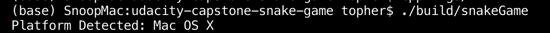
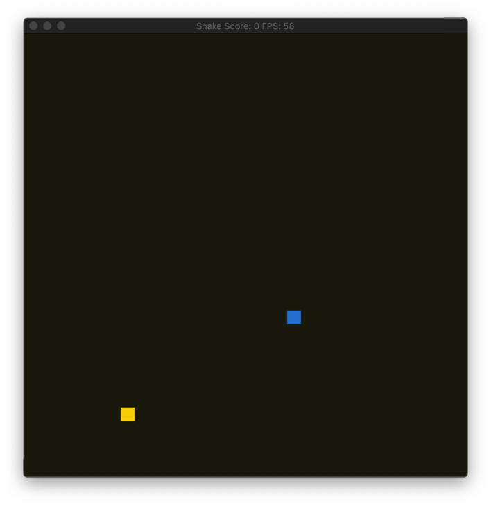

# Udacity C++ Nanodegree

## `Project: Capstone Snake Game Clone`

# Overview

This C++ project is the capstone project (final) of the Udacity C++ Nanodegree.
The source code has been mostly adapted from the provided starter code located at (Udacity's repo)[https://github.com/udacity/CppND-Capstone-Snake-Game].
The code base can be divided architecturally and functionally into four distinct class-based components:

- Renderer component is responsible for rendering the state of the game using the popular [SDL library](https://www.libsdl.org/)

- Game component constructs and maintains the game board and placement of the game elements like the snake and food.

- Snake component constructs and maintains the snake object as it moves across the board gaining points and checking if it ran into itself.

- Controller component receives input from the user in order to control movement of the snake.

Once the game starts and creates the `Game`, `Controller`, and `Snake` objects, the game continues to loop through each component as it grabs input from the user, `Controller`, updates the state of the `Game`, and graphically renderers the state of the game, `Render`.

Upon lauching the game, the user is first greeted with the detected system platform.

The user is then asked for the starting game diffuculty level which reflects the speed of the `snake`

The game board launches after the user provides a valid speed and the user is able to play the game by moving the snake around with the arrow keys.

## Dependencies for Running Locally

- cmake >= 3.7
  - All OSes: [click here for installation instructions](https://cmake.org/install/)
- make >= 4.1 (Linux, Mac), 3.81 (Windows)
  - Linux: make is installed by default on most Linux distros
  - Mac: [install Xcode command line tools to get make](https://developer.apple.com/xcode/features/)
  - Windows: [Click here for installation instructions](http://gnuwin32.sourceforge.net/packages/make.htm)
- SDL2 >= 2.0
  - All installation instructions can be found [here](https://wiki.libsdl.org/Installation)
  - Note that for Linux, an `apt` or `apt-get` installation is preferred to building from source.
- gcc/g++ >= 5.4
  - Linux: gcc / g++ is installed by default on most Linux distros
  - Mac: same deal as make - [install Xcode command line tools](https://developer.apple.com/xcode/features/)
  - Windows: recommend using [MinGW](http://www.mingw.org/)

## Basic Build Instructions

1. Clone this repo.
2. Make a build directory in the top level directory: `mkdir build && cd build`
3. Compile: `cmake .. && make`
4. Run it: `./snakeGame`.

# Rubric Items Matched

### 1

### `Object Oriented Programming - The project uses Object Oriented Programming techniques.`

> The project code is organized into classes with class attributes to hold the data, and class methods to perform tasks.

To meet this requirement, a `MetaGame` class was created (inside `metagame.h`) to hold information about the system platform. The class uses the member functions `getPlatform` and `printPlatform` to fetch and printout the user's detected system platform.

### 2

### `Object Oriented Programming - Classes use appropriate access specifiers for class members.`

> All class data members are explicitly specified as public, protected, or private.

Within `metagame.h`, the private variable `platformUsed` (line 19) is used to store the user's detected system. No other class can mutate this variable.

### 3

### `Object Oriented Programming - Class constructors utilize member initialization lists.`

> All class members that are set to argument values are initialized through member initialization lists.

Within `metagame.h` (line 11) the default argument for the private variable `platformUsed` is a null string which is set within the class's initiaziation list.

### 4

### `Object Oriented Programming - Classes abstract implementation details from their interfaces.`

> All class member functions document their effects, either through function names, comments, or formal documentation. Member functions do not change program state in undocumented ways.

The [C++ Guide by Google](https://google.github.io/styleguide/cppguide.html#Function_Comments) was used to for any needed documentation. An example can be found within `metagame.h` (line 16) above the function declaration of `getPlatform` where a simple comment is used to describe what the function does. Also, a function comment can be found in `snake.h` line 25.

### 5

### `Loops, Functions, I/O - The project accepts user input and processes the input.`

> The project accepts input from a user as part of the necessary operation of the program.

The user has the option to select the difficulty level of the snake game which relates the speed of snake. A Game class member function `UpdateStartSpeed` (main.cpp line 23) is called and this member function encapsulates the Game's private data member `snake` and calls the Snake class member function `SetStartingSpeed` (game.cpp line 61). As this point, according to the function declaration comments (`snake.h` line 25), the function `SetStartingSpeed` first asks the user for a starting diffuculty level and relates the level within an acceptable, pre-defined range in between `minStartLevel` and `maxStartLevel` variables. The function then proceeds to validate the user's input and assign it to the Snake's private member `speed`.
